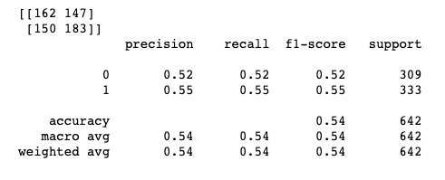
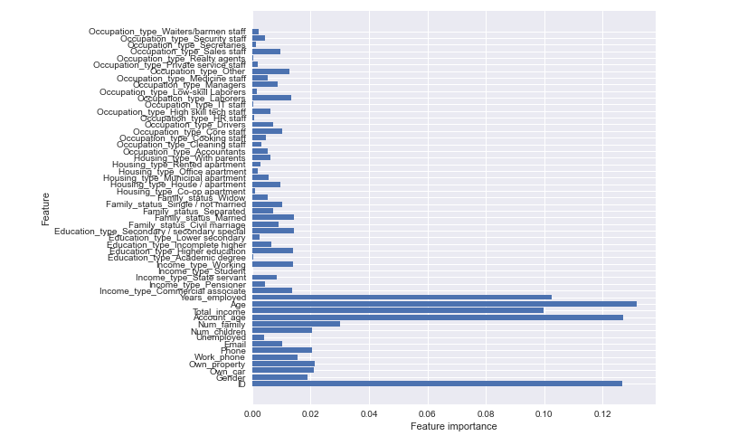

# Phase 3 Project 

**Author**: Alec Hing


## Project Overview

Using a classification model, this project will focus on predicting whether an applicant is a "good" or "bad" customer who's applying for a credit card based on an application record and credit record dataset.

## Business Problem

A credit card can be a useful tool in the daily lives of a consumer. It helps to build credit and trust for future loans one might take and allows someone to purchase something where they might not have direct cash on hand. It takes a responsible person to balance their budgets and know their spending limits.
In the case where someone cannot pay off their amount owed by their due date, it results in their credit score to be negatively effected. If this case happens too frequently, they will most likely be deemed an at risk applicant for future applications to banks. 
Not being able to pay off their bills can be due to numerous factors someone goes through in life, which get taken into account when an applicant applies for a credit card (age, years employment status, income, and credit history to name a few).
With all that being said, determining if a person is an at risk applicant can be hard with so many factors to consider.


## The Data

The datasets used in this classification model are from [Kaggle](https://www.kaggle.com/datasets/rikdifos/credit-card-approval-prediction). Two datasets are provided, those being: `application_record.csv`  and `credit_record.csv` which are found in the data folder.

The following featuring were used in total for this data analysis:
* `ID`
* `Gender`
* `Own_car`
* `Own_property`
* `Work_phone`
* `Phone`
* `Email`
* `Unemployed`
* `Num_children`
* `Num_family`
* `Account_age`
* `Total_income`
* `Age`
* `Years_employed`
* `Income_type`
* `Education_type`
* `Family_status`
* `Housing_type`
* `Occupation_type`


## Approach to Models and Methods

This classification model project consisted of going through the scrubbing/cleaning process, preprocessing, developing a baseline model and then from there, numerous other models to hopefully improve the results of the baseline. Those other models that were created are: a baseline with SMOTE data, Grid Search CV, Random Forests, using undersampled data for the Random Forest model, XG Boost, and finally another XG Boost Model where the paramerters are tuned.

After each model there was a confusion matrix and classification report made. The values that were paid attention to the most were the number of False Negatives and the Recall value. Accuracy was also taken into account on the final selection of which model preformed the best. False negatives played a huge role in the finaly result for this project because it would be a worse outcome for a stakeholder if the model predicted a person was not a risky client when in fact they were. Conversely, false postives did not matter as much because predicting a person is a risk when they actually were not would not be as bad for a company.


## Results

At first, the best model ended up being the baseline model that was fitted with SMOTE data amongst the models that were not undersampled. It had the least amount of false negatives, which was a priority for this project because that essentially means the model predicted that those individuals were deemed safe to be approved for a credit card when in actuality they were a risk. The accuracy of this model ended up being 74%. Sometimes these numbers can be misleading though.

The model with the best recall value, which I believe matters the most due to this business model is the Random Forest model that used undersampled data. This model had a recall value of 54%, meaning out of all the actually people that owed money, the model predicted 54% of them correctly which is way better than all the other models that had a recall under 20%. Therefore, due to these results I would recommend using this model going further. The accuracy was lower than other models but prioritizing the prediction of those that owe money I believe should take precedent over a bunch of False Positives , which is why the accuracy is misleading in this case. The higher accuracies in the other models were because it predicted more people that were not a risk. Basically, there were way more true negatives than there were true positives as a whole which made it seem like the model's accuracy was predicting a lot of TP's and TN's.

The major feature that had the greatest impact on this model was a person's age. Other features that had an impact on the model were: a person's total income, their account age, and the years a person was employed for.

### Classification Report




### Feature Importance





## Conclusion

All in all, many of the models with the baseline data returned about the same results. All though their prediction of true negatives (predicting those that are not a risky client) were excellent, they didn't have great results when it came to predicting true postives (those that were risky clients). 

Undersampling the data did give a better result in terms of recall. An underasmpled ramdom forest model predicted 54% of risky clients. Due to these results, I would suggest using this model going forward due to it's ability to predict risky clients.

In the future to imporove these models, several things can be done. Number 1 would be to try and improve the overall recall value without undersampling. This could be done with more parameter tuning. There were also some features in these models that probably unnecessary like: email, phone, and  work phone to name a few. Reducing noise in these dataset would have probably have a positive affect.

## For More Information

For any additional questions, please contact **Alec & ahing619@gmail.com**
Full analysis of this project is in a [Jupyter notebook](./student.ipynb) or in the [presentation](./Phase3_Presentation.pdf)


## Repository Structure

```
├── data                                <- Both sourced externally and generated from code
├── images                              <- Generated from code
├── students.ipynb                      <- Analysis in of this project in Jupyter notebook
├── Phase3_Presentation.pdf             <- Non- Technical PDF version of project presentation
└── README.md                           <- Overview of what this project entails and its results